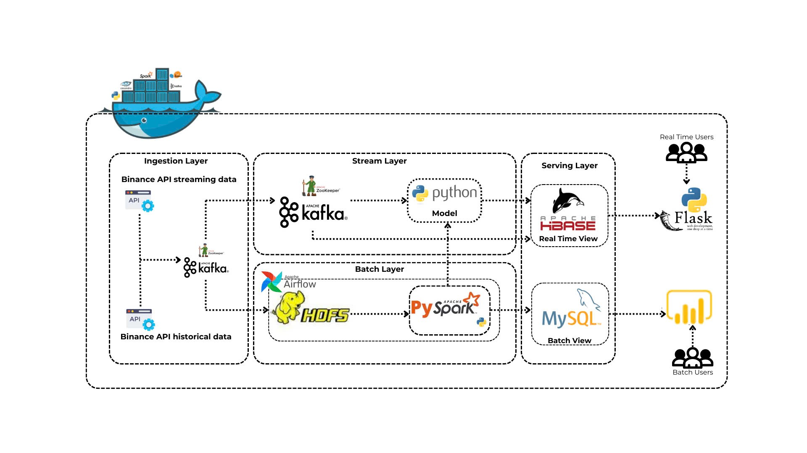

# Crypto Price Project

`Author`:

| Họ và tên       | Mã sinh viên | Khóa             |
| ----------------- | -------------- | ------------------ |
| Phạm Thành Long | 22022604     | QH-2022-I/CQ-A-AI2 |
| Trần Tiến Nam   | 22022594     | QH-2022-I/CQ-A-AI2 |
| Phan Văn Hiếu   | 22022527     | QH-2022-I/CQ-A-AI2 |
| Nguyễn Đức Minh | 22022533     | QH-2022-I/CQ-A-AI2 |

`SLIDE and REPORT`:

- [Slide](https://github.com/longluv1605/crypto-streaming-bigdata/blob/main/SLIDE.pdf)
- [Report](https://github.com/longluv1605/crypto-streaming-bigdata/blob/main/REPORT.pdf)

## 1. How to run our project

1. Setup docker, docker-compose
2. Move to root directory of our repository
3. Run this command:
    `docker-compose up --build -d`

Then you can:

- Run command `docker-compose ps -a`: Check containers status
- Run command `docker-compose logs <container-name> -f`: Check `<container-name>` logs
- Run command `docker exec -it <container-name> bash`: Execute and interact with `<container-name>` terminal
- Browse `http://localhost:16010`: Check hbase information
- Browse `http://localhost:9870`: Check HDFS information
- Browse `http://localhost:8080`: Interact with Airflow Web UI
- Browse `http://localhost:5000`: View streaming chart

## 2. Our project Architecture

### 2.1. Tools

1. Docker
2. Python
3. Spark
4. Kafka
5. Hadoop HDFS
6. HBase
7. Mysql
8. Airflow
9. Flask (option)
10. PowerBI (option)

### 2.2. Architecture

Our project's architecture consist of Ingestion layer, Stream layer, Batch layer, Serving layer and Endpoint applications (Flask web, PowerBI app).

#### 2.2.1. Ingestion layer

This layer `serving raw data` for Stream layer and Batch layer via `Kafka Producer`.

#### 2.2.2. Stream layer

The workflow of this layer is:

1. Receive data from Kafka via `Kafka Consumer`
2. Use `trained model` to predict price after `one minute`
3. Insert `processed real price` and `predicted price` into `HBase`

#### 2.2.3. Batch layer

Batch layer is built to:

1. Get `raw` historical crypto price and put to `HDFS Datalake and Mysql`
2. Use Pyspark to `process` data and insert into `HDFS Warehouse and Mysql`
3. `Train` model to predict future price

Airflow is used to:

1. Operate data processing `every day`
2. `Monthly` refresh model
